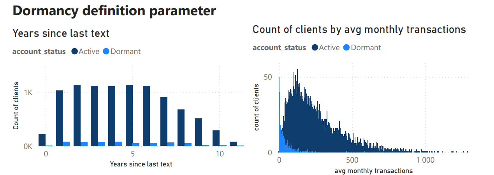
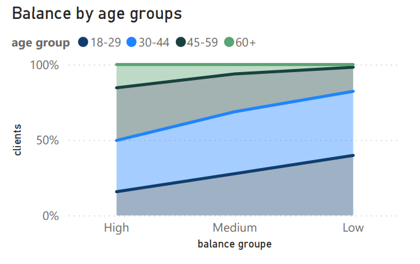
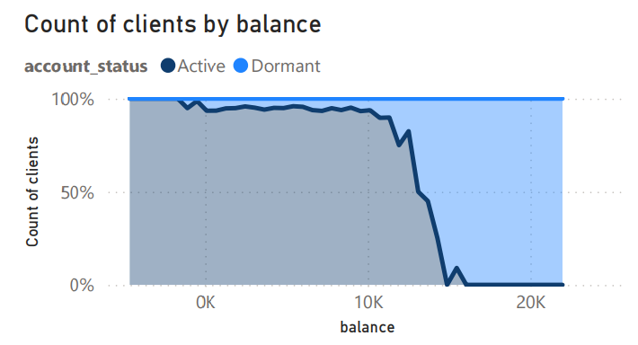
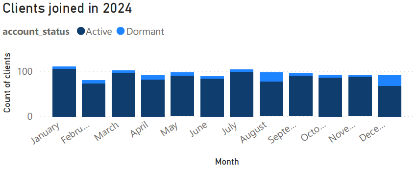

# Project Background

This project analyzes customer segments to identify where dormant risk is highest and where significant balances are held by inactive accounts, with the goal of improving reactivation and retention strategies.

Insights and recommendation are provided on the folowing areas:

-   Which **customer segments** have the highest risk of becoming dormant
-   Where the largest **share of balance** is concentrated among dormant accounts
-   What **behavioral signals** (e.g. transaction activity) indicate inactivity

An interactive PowerBI dashboard can be downloaded [there](https://github.com/marss82/dormancy-exploration/blob/4773c6f0dedb19df3ecd90bb0124d26b0448e9ea/visualisation.pbit)

The Excel data and pivot tables can be found [there](https://github.com/marss82/dormancy-exploration/blob/4773c6f0dedb19df3ecd90bb0124d26b0448e9ea/synthetic_dirty_bank_clients.xlsx)

# Data Structure & Initial Checks / Methology
we have table with 12000 records of 
1. cleaning and transforming data with excel
2. initial exploration with pivot tables in excel
3. deep dive analysis and searching for possible reasons with PowerBI 
 
# Excecutive summary
## Overview of findings

The analysis shows that dormant customers represent a relatively small share of the customer base (~6%)  but they hold a disproportionately higher share of total balances (~7.8%). This indicates that a meaningful amount of funds is concentrated in inactive accounts across different product types.

 ### Dormancy definition
Transaction activity appears to be the strongest indicator of dormancy. Most dormant accounts show very low usage, with fewer than 5 transactions per month. However, there is also a smaller group of dormant customers with high transaction counts, mainly within checking accounts with higher balances. This suggests that not all activity reflects real customer engagement and may include automated transactions.

Interestingly, the time since last transaction does not fully explain dormancy. Many dormant users still show relatively recent activity (2024–2025). At the same time, the maximum observed time between account opening and last transaction is around 5 years, even for long-tenure customers. And a lot of active costumers had last transaction years ago. This suggests that the current definition of dormancy may not fully capture long-term inactivity and could be reconsidered.

### Balance
From a balance perspective, dormant accounts rarely have negative balances and are more likely to hold higher amounts, often exceeding 10k and reaching up to 22k. Older customers tend to have higher balances overall, while their likelihood of becoming dormant remains similar compared to other groups.
 
 

### Tenure

Looking at tenure, customers in their first year show a slightly higher tendency to become dormant, indicating a potential issue with early engagement. Additionally, a noticeable increase in dormant users can be seen among customers who joined in August and December in both 2023 and 2024, while the number of active users remained stable. This pattern may be linked to seasonal campaigns or onboarding differences.

Finally, there is no available data for customers who joined in 2025 or 2026, which suggests missing or incomplete data and should be considered when interpreting the results.

## Recommendations
  
- The definition of dormancy may need adjustment. Most dormant users have 0–5 monthly transactions, but many active customers have had no transactions for years.

- Use low transaction activity (e.g. <5 per month) as an early warning signal to identify customers at risk of becoming dormant.

- Focus on high-balance dormant accounts (>10k), because they hold 6,4% of all money but show low activity.

- Investigate accounts with high transaction counts but marked as dormant to distinguish between real usage and automated activity.

 - Determine if dormancy is higher in the first year or just a recent trend.

 - Check campaigns or promotions in August and December — they might be bringing users who become inactive.

- Prioritize retention strategies for customers with high balances, as they represent stable and valuable segments.

# Next steps
- Cohort Analysis 
 Understand if dormancy is a lifecycle problem
 - Dormancy Risk Score
 Predict who will become dormant
  - Reactivation Experiment (A/B testing)
 Test if you can bring dormant users back
